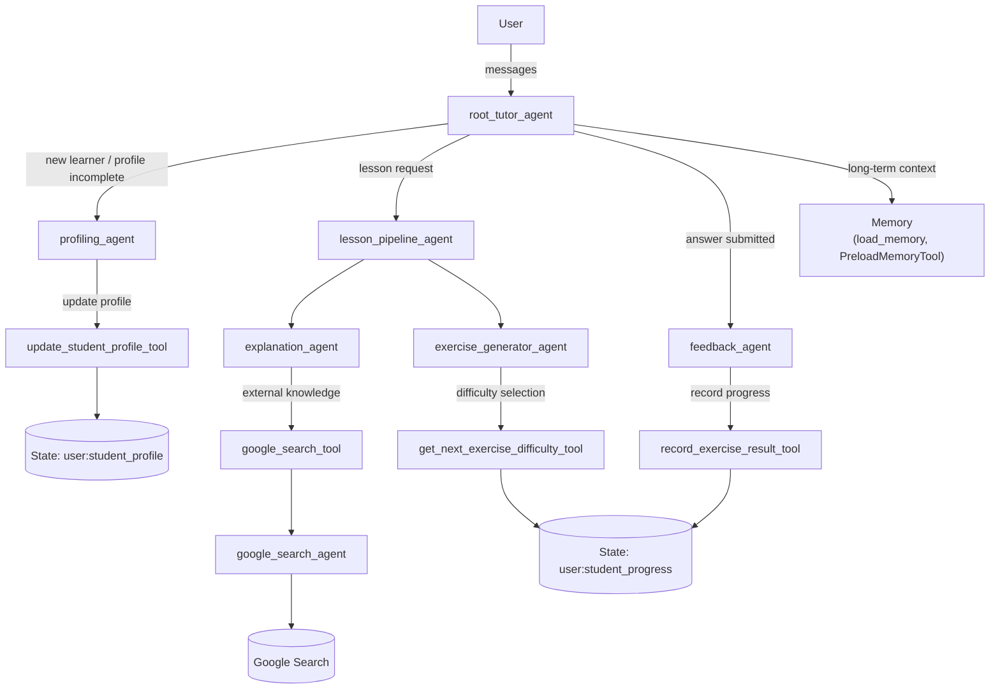

# Agentic AI Tutor with Google ADK
**An adaptive multi-agent AI tutor built with Google Agent Development Kit (ADK)**

> Personalized explanations, intelligent exercise progression, and long-term learner modeling.

---

## Table of Contents

- [Overview](#overview)
- [Features](#features)
- [Architecture](#architecture)
- [Project Structure](#project-structure)
- [Prerequisites](#prerequisites)
- [Getting Started](#getting-started)
- [Running the Tutor (CLI)](#running-the-tutor-cli)
- [Evaluation](#evaluation)
- [Design Highlights](#design-highlights)
- [Extending the Project](#roadmap--future-work)
- [License](#license)

---

## Overview

**Agentic AI Tutor with Google ADK** is an adaptive tutoring system built on top of the **Google Agent Development Kit (ADK)** and Gemini.
It behaves more like a real instructor:

- Profiles the learner’s **background, goals, and learning style**.
- Explains concepts at the appropriate level, using **long-term memory and web search**.
- Generates practice exercises with **adaptive difficulty**.
- Grades answers and updates a **mastery model** per topic.
- Persists state and uses **context compaction** to keep sessions efficient.

---

## Features

- **Multi-agent system**
  - `root_tutor_agent`: user-facing orchestrator
  - `profiling_agent`: builds and updates the learner’s profile
  - `explanation_agent`: explains concepts using profile, memory, and search
  - `exercise_agent`: generates targeted questions with adaptive difficulty
  - `feedback_agent`: evaluates answers and updates progress
  - `lesson_pipeline_agent`: sequential “Explain → Practice” flow
  - `google_search_agent`: isolated agent that uses ADK’s `google_search` built-in tool

- **Tools & Memory**
  - Custom `FunctionTool`s:
    - `update_student_profile`
    - `record_exercise_result`
    - `get_next_exercise_difficulty`
  - `AgentTool`:
    - `google_search_tool` wrapping `google_search_agent`
  - ADK memory tools:
    - `load_memory`, `PreloadMemoryTool` for long-term context
  - Session state:
    - `user:student_profile` (level, goals, style, focus topics)
    - `user:student_progress` (accuracy, topic stats, difficulty history)

- **Adaptive difficulty**
  - Accuracy-based strategy chooses `"easy" | "medium" | "hard"` per topic based on prior performance.

- **Context engineering**
  - `EventsCompactionConfig` and `LlmEventSummarizer` summarize older events while preserving recent turns.

- **Observability**
  - `after_agent_callback` logs agent name, invocation id, and an approximate overall accuracy metric once the tutor has seen some exercises.

---

## Architecture

At a high level, the system works as follows:

1. The user interacts with the **root tutor agent** (`root_tutor_agent`).
2. The root agent decides whether to:
   - Delegate to `profiling_agent` (new or incomplete profile),
   - Delegate to `lesson_pipeline_agent` (user wants to learn a topic),
   - Delegate to `feedback_agent` (user submits an answer).
3. `lesson_pipeline_agent` is a `SequentialAgent` that:
   - First calls `explanation_agent` to teach the concept,
   - Then calls `exercise_agent` to generate questions.
4. `exercise_agent` uses a difficulty-selection tool based on the strategy pattern to choose the next difficulty level.
5. `feedback_agent`:
   - Evaluates user answers,
   - Calls a tool to update `StudentProgress` (overall and per-topic),
   - Returns targeted feedback and next-step guidance.
6. `search_agent`:
   - Is the only agent that directly uses ADK’s `google_search` built-in tool,
   - Is exposed to other agents as a function-style `AgentTool` so they can “call search” without mixing built-in tools with function tools (Because ADK doesn't allow google search built-in tool to be used with other tools for an agent!!!).

Domain models (`core/models.py`) define:

- `StudentProfile`
- `StudentProgress`
- `TopicStats`

State helpers (`core/state.py`) read/write these models into ADK session state (`user:student_profile`, `user:student_progress`).

LLM configuration (`core/llm.py`) centralizes Gemini model setup (model name, retry options, temperature, etc.).



---

## Project Structure

```text
agentic-ai-tutor-with-googleadk/
├─ .env.example
├─ pyproject.toml
├─ README.md
└─ src/
   ├─ __init__.py
   ├─ config.py               # env-based configuration (APP_NAME, model, API key)
   ├─ app_factory.py          # builds ADK App with context compaction and memory wiring
   ├─ agent.py                # ADK Web entrypoint: exposes root_agent for `adk web .`
   ├─ core/
   │  ├─ __init__.py
   │  ├─ difficulty_strategy.py  # Strategy pattern for difficulty selection
   │  ├─ llm.py                  # Gemini model factory
   │  ├─ models.py               # StudentProfile, StudentProgress, TopicStats
   │  ├─ observability.py        # after-agent callback & logging helpers
   │  ├─ state.py                # read/write domain models from ADK state
   │  └─ tools.py                # custom tools
   ├─ agents/
   │  ├─ __init__.py
   │  ├─ explanation_agent.py
   │  ├─ exercise_agent.py
   │  ├─ feedback_agent.py
   │  ├─ lesson_pipeline_agent.py
   │  ├─ profiling_agent.py
   │  ├─ root_tutor_agent.py     # builds the main tutor orchestrator
   │  └─ search_agent.py         # uses built-in google_search tool
   ├─ cli/
   │  ├─ __init__.py
   │  └─ main.py                 # interactive CLI
   └─ evaluation/
      ├─ __init__.py
      ├─ manual_eval.py          # custom InMemoryRunner-based tests
      └─ adk_eval.py             # AgentEvaluator-based eval (evalset file)
```

---

## Prerequisites

- Python 3.11+

- A valid Google AI / Gemini API key (GOOGLE_API_KEY)

## Getting Started

1. **Clone the repository**
  ```bash
  git clone https://github.com/AliEhsanian/Agentic-AI-Tutor-with-GoogleADK.git
  cd agentic-ai-tutor-with-googleadk
  ```

2. **Install dependencies**
   ```bash
   uv install
   uv sync
   ```

3. **Set up environment variables**
  Copy `.env.example` to `.env`:
  ```bash
  cp .env.example .env
  ```
  Edit `.env` and add your API keys:
  ```bash
  GOOGLE_API_KEY=your_real_api_key_here
  GEMINI_MODEL_NAME=gemini-2.5-flash-lite  # or another Gemini model
  APP_NAME=agentic_ai_tutor_with_googleadk
  ```

---

## Running the Tutor (CLI)
From the project root:
```bash
uv run python -m src.cli.main
```

Example interaction:

> you > Hi, I'm a beginner in reinforcement learning. Can you help me learn.

> tutor > Hi there! I'm here to help tailor the learning experience to you. To start, could you tell me a bit about your background?

Type `exit` to leave the CLI.

---

## Evaluation
The project includes three types of evaluation:

**Manual evaluation (quick behavior checks)**

Runs small scripted tests that send known prompts and check for expected behaviors (e.g., “background” appears in profiling answers).
```bash
uv run python -m src.evaluation.manual_eval
```

**Evaluation in ADK Web**

To use the Dev UI for experimentation and evaluation:
```bash
uv run adk web .
```
Then:
  - src/agent.py exposes root_agent, which is the tutor entrypoint.
  - Open the printed URL (http://127.0.0.1:8000/dev-ui) in your browser.
  - In the top-left selector, choose src as the agent and start chating.
  - In the Eval section, you can run evaluations.

**ADK evaluation (AgentEvaluator with evalset)**

To use ADK’s evaluation framework, you need an evalset, a JSON file describing evaluation cases (conversations and expectations):
- Create an evalset using the Dev UI:
  - Run uv run adk web .
  - Open the printed local URL in your browser (http://127.0.0.1:8000).
  - Interact with the agent in the browser.
  - From the eval section, add session(s) to an evaluation and export the evalset as: ai_tutor_basic
- Run the ADK evaluation:
```bash
uv run python -m src.evaluation.adk_eval
```
- You can change the evaluation config, in the eval_config.json file.

---

## Design Highlights
**Multi-agent orchestration**
  - Clear separation of responsibilities: profiling, explanation, exercise generation, feedback, search.
  - root_tutor_agent coordinates all sub-agents to implement a full teaching loop.

**Tool-centric design**
  - Custom tools for profile and progress management.
  - AgentTool wrapper around google_search_agent to safely use Google Search without breaking Gemini’s tool-type constraints.

**Sessions & memory**
  - Uses ADK state and memory tools to maintain StudentProfile and StudentProgress across an interactive session.

**Context compaction**
  - EventsCompactionConfig and LlmEventSummarizer automatically summarize older interactions, keeping recent turns intact while staying within context limits.

**Observability**
  - tutor_after_agent_callback logs key metrics (agent name, invocation id, approximate accuracy) for debugging and iteration quality tracking.

---

## Extending the Project

**Content ingestion**
  - Add tools to read course notes from a local folder, GitHub repositories, Notion pages, etc. This would turn the tutor into a personalized overlay on top of the learner’s own curriculum.

**Front-ends**
  - Wrap InMemoryRunner in FastAPI / Flask.
  - Build a Streamlit or Gradio UI around the tutor.

**Richer evaluation**
  - Add more manual tests.
  - Additional evalsets for different learner profiles (beginner/intermediate/advanced).

**Persistent memory**
  - Swap InMemoryMemoryService with a persistent backend:
  - database,
  - vector store,
  - Vertex AI Memory Bank

---

## License

This project is licensed under the MIT License.
